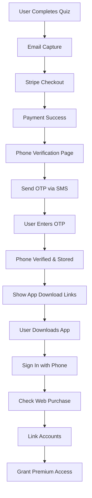

# Web-to-App Authentication Implementation Guide

## Overview
This document outlines the implementation of a phone verification system that links web Stripe purchases with mobile app access for the Lucid quiz application.

## Table of Contents
1. [Architecture Overview](#architecture-overview)
2. [User Flow](#user-flow)
3. [Implementation Phases](#implementation-phases)
4. [Technical Details](#technical-details)
5. [Security Considerations](#security-considerations)
6. [Testing Plan](#testing-plan)
7. [Troubleshooting](#troubleshooting)

## Architecture Overview

### Current State
- **Web App**: Quiz → Email capture → Stripe checkout → Success
- **Mobile App**: Download → Phone/Email/Apple auth → Paywall → Subscribe
- **Gap**: No connection between web purchases and app authentication

### Target State
- **Web App**: Quiz → Email → Stripe → Phone verification → App access instructions
- **Mobile App**: Download → Phone auth → Auto-detect web purchase → Grant access

### Data Flow Diagram


## User Flow

### Web Purchase Flow
1. User completes mindfulness quiz
2. Enters email on results page
3. Proceeds to Stripe checkout
4. Selects subscription plan (7-day, 1-month, 3-month)
5. Completes payment via Stripe
6. Redirected to phone verification page
7. Enters phone number
8. Receives SMS with 6-digit code
9. Enters verification code
10. Phone verified and linked to purchase
11. Shown app download instructions with deep links

### App Authentication Flow
1. User downloads Lucid app
2. Opens app and navigates to sign-in
3. Selects "Sign in with Phone"
4. Enters same phone number used on web
5. Receives SMS verification code
6. Enters code to authenticate
7. App checks for web purchases linked to phone
8. Automatically grants premium access
9. Navigates to main app experience

## Implementation Phases

### Phase 1: Database Infrastructure (Day 1)

#### 1.1 Create Migration File
```sql
-- File: supabase/migrations/003_add_phone_auth_fields.sql

-- Add phone authentication fields to users table
ALTER TABLE users 
ADD COLUMN phone_number TEXT,
ADD COLUMN phone_verified BOOLEAN DEFAULT false,
ADD COLUMN phone_verified_at TIMESTAMP WITH TIME ZONE,
ADD COLUMN supabase_user_id UUID;

-- Create indexes
CREATE INDEX idx_users_phone ON users(phone_number);
CREATE INDEX idx_users_supabase_user_id ON users(supabase_user_id);

-- Create auth_links table
CREATE TABLE IF NOT EXISTS auth_links (
  id UUID PRIMARY KEY DEFAULT gen_random_uuid(),
  web_user_id UUID REFERENCES users(id) ON DELETE CASCADE,
  supabase_user_id UUID NOT NULL,
  phone_number TEXT NOT NULL,
  linked_at TIMESTAMP WITH TIME ZONE DEFAULT NOW(),
  linked_via TEXT DEFAULT 'phone',
  metadata JSONB DEFAULT '{}',
  UNIQUE(web_user_id, supabase_user_id)
);

-- Create function to link accounts
CREATE OR REPLACE FUNCTION link_web_purchase_to_app_user(
  p_phone_number TEXT,
  p_supabase_user_id UUID
) RETURNS JSON AS $$
-- Function implementation
$$ LANGUAGE plpgsql SECURITY DEFINER;
```

#### 1.2 Apply Migration
```bash
# Run migration on Supabase
supabase db push
```

### Phase 2: Phone Verification Components (Day 1-2)

#### 2.1 PhoneVerification Component
```typescript
// src/components/PhoneVerification.tsx
interface PhoneVerificationProps {
  onVerificationComplete: (phoneNumber: string) => void;
  userId: string;
}

export const PhoneVerification: React.FC<PhoneVerificationProps> = ({
  onVerificationComplete,
  userId
}) => {
  // Component implementation
  // - Phone input with intl-tel-input
  // - Country code selector
  // - Validation
  // - Send OTP button
};
```

#### 2.2 OTPVerification Component
```typescript
// src/components/OTPVerification.tsx
interface OTPVerificationProps {
  phoneNumber: string;
  onSuccess: () => void;
  onResend: () => void;
}

export const OTPVerification: React.FC<OTPVerificationProps> = ({
  phoneNumber,
  onSuccess,
  onResend
}) => {
  // Component implementation
  // - 6 input fields for OTP
  // - Auto-advance logic
  // - Countdown timer
  // - Resend functionality
};
```

#### 2.3 VerificationSuccess Component
```typescript
// src/components/VerificationSuccess.tsx
export const VerificationSuccess: React.FC = () => {
  // Component implementation
  // - Success message
  // - App store buttons
  // - Deep link button
  // - Instructions
};
```

### Phase 3: Phone Verification Page (Day 2)

#### 3.1 Create Verification Route
```typescript
// src/pages/checkout/verify-phone.tsx
export default function VerifyPhonePage() {
  const [step, setStep] = useState<'phone' | 'otp' | 'success'>('phone');
  const [phoneNumber, setPhoneNumber] = useState('');
  
  // Page implementation
  // - Check payment status
  // - Show appropriate step
  // - Handle verification flow
}
```

#### 3.2 Update Routing
```typescript
// Update checkout success redirect
// src/pages/checkout/success.tsx
useEffect(() => {
  if (paymentComplete && !phoneVerified) {
    router.push('/checkout/verify-phone');
  }
}, [paymentComplete, phoneVerified]);
```

### Phase 4: Supabase Auth Integration (Day 2-3)

#### 4.1 Phone Auth Service
```typescript
// src/services/phoneAuth.ts
export class PhoneAuthService {
  async sendOTP(phoneNumber: string) {
    const { data, error } = await supabase.auth.signInWithOtp({
      phone: phoneNumber,
    });
    return { data, error };
  }

  async verifyOTP(phoneNumber: string, token: string) {
    const { data, error } = await supabase.auth.verifyOtp({
      phone: phoneNumber,
      token: token,
      type: 'sms',
    });
    return { data, error };
  }

  async updateUserPhone(userId: string, phoneNumber: string) {
    const { data, error } = await supabase
      .from('users')
      .update({ 
        phone_number: phoneNumber,
        phone_verified: true,
        phone_verified_at: new Date().toISOString()
      })
      .eq('id', userId);
    return { data, error };
  }
}
```

### Phase 5: Update Stripe Webhook (Day 3)

#### 5.1 Enhance Webhook Handler
```typescript
// supabase/functions/stripe-webhook/index.ts
case 'checkout.session.completed': {
  const session = event.data.object as Stripe.Checkout.Session;
  
  // Existing payment processing...
  
  // Add phone verification flag
  await supabase.from('users').update({
    phone_verification_required: true,
    phone_verification_expires_at: new Date(Date.now() + 7 * 24 * 60 * 60 * 1000) // 7 days
  }).eq('id', userId);
  
  break;
}
```

### Phase 6: Edge Functions (Day 3-4)

#### 6.1 Phone Verification Function
```typescript
// supabase/functions/verify-phone-purchase/index.ts
import { serve } from 'https://deno.land/std@0.168.0/http/server.ts'
import { createClient } from '@supabase/supabase-js'

serve(async (req) => {
  const { phone_number, user_id } = await req.json()
  
  // Create Supabase client
  const supabase = createClient(
    Deno.env.get('SUPABASE_URL') ?? '',
    Deno.env.get('SUPABASE_SERVICE_ROLE_KEY') ?? ''
  )
  
  // Call link function
  const { data, error } = await supabase.rpc('link_web_purchase_to_app_user', {
    p_phone_number: phone_number,
    p_supabase_user_id: user_id
  })
  
  return new Response(JSON.stringify(data), {
    headers: { 'Content-Type': 'application/json' },
  })
})
```

### Phase 7: Mobile App Updates (Day 4)

#### 7.1 Update Auth Success Handler
```typescript
// lucid/app/auth.tsx
const handleAuthSuccess = async () => {
  try {
    // Existing auth sync...
    
    // Check for web purchases
    const user = await getCurrentUser();
    if (user?.phone) {
      const { data: linkResult } = await supabase.functions.invoke('verify-phone-purchase', {
        body: {
          phone_number: user.phone,
          user_id: user.id
        }
      });
      
      if (linkResult?.success && linkResult?.subscription) {
        // Update RevenueCat with subscription info
        await syncWebSubscriptionToRevenueCat(linkResult.subscription);
        
        // Navigate to main app
        router.replace("/(tabs)");
        return;
      }
    }
    
    // Continue with normal flow...
  } catch (error) {
    console.error('Error checking web purchases:', error);
  }
};
```

#### 7.2 Web Purchase Service
```typescript
// lucid/lib/webPurchaseService.ts
export const syncWebSubscriptionToRevenueCat = async (subscription: {
  plan: string;
  end_date: string;
  stripe_customer_id: string;
}) => {
  // Map web plan to RevenueCat product ID
  const productIdMap = {
    '7-day-trial': 'lucid_7_day',
    '1-month': 'lucid_monthly',
    '3-month': 'lucid_3_month'
  };
  
  // Update RevenueCat
  // This would require custom RevenueCat integration
  // or manual subscription management
};
```

### Phase 8: Testing & Edge Cases (Day 5)

#### Test Scenarios
1. **Happy Path**: New user completes full flow
2. **Existing Phone**: User tries to verify already-used phone
3. **Multiple Devices**: Same user on multiple devices
4. **Expired OTP**: User waits too long to enter code
5. **Network Failures**: Handle connection issues gracefully
6. **Rate Limiting**: Prevent OTP spam

#### Edge Cases to Handle
- User changes phone number after purchase
- Multiple accounts with same phone
- International phone numbers
- OTP delivery failures
- Subscription expiration during verification

### Phase 9: UI/UX Polish (Day 5-6)

#### Loading States
```typescript
// Show loading spinner during:
// - OTP sending
// - OTP verification
// - Account linking
// - App store redirect
```

#### Error Messages
```typescript
const errorMessages = {
  INVALID_PHONE: "Please enter a valid phone number",
  OTP_EXPIRED: "Verification code expired. Please request a new one",
  PHONE_IN_USE: "This phone number is already linked to another account",
  NETWORK_ERROR: "Connection error. Please try again",
  RATE_LIMITED: "Too many attempts. Please wait before trying again"
};
```

### Phase 10: Documentation & Deployment (Day 6)

#### Deployment Checklist
- [ ] Run database migrations
- [ ] Deploy edge functions
- [ ] Update environment variables
- [ ] Deploy web app changes
- [ ] Submit app update to stores
- [ ] Update documentation
- [ ] Monitor error logs
- [ ] Test in production

## Technical Details

### Phone Number Storage
- **Format**: E.164 (+1234567890)
- **Display**: National formatting ((123) 456-7890)
- **Validation**: libphonenumber-js
- **International**: Support all countries

### OTP Configuration
- **Length**: 6 digits
- **Expiration**: 60 seconds
- **Rate Limit**: 1 per minute per phone
- **Max Attempts**: 3 per session
- **Delivery**: SMS via Twilio (Supabase)

### Security Measures
- Phone numbers hashed in logs
- OTP codes not stored in plain text
- Rate limiting on all endpoints
- Session validation for all requests
- HTTPS only for all communications

## Security Considerations

### Data Protection
1. **PII Handling**
   - Phone numbers encrypted at rest
   - Minimal data exposure in URLs
   - No phone numbers in analytics

2. **Authentication Security**
   - OTP codes expire quickly
   - Rate limiting prevents abuse
   - Session tokens rotated regularly

3. **Account Linking Security**
   - Verify phone ownership before linking
   - Prevent unauthorized account access
   - Audit trail for all linking events

### Compliance
- GDPR: Phone numbers deletable on request
- CCPA: User data export available
- SMS regulations: Opt-in required

## Testing Plan

### Unit Tests
```typescript
// Test phone number validation
// Test OTP generation/verification
// Test account linking logic
// Test error handling
```

### Integration Tests
```typescript
// Test full verification flow
// Test Stripe webhook integration
// Test Supabase auth flow
// Test RevenueCat sync
```

### E2E Tests
```typescript
// Test web purchase → app access
// Test error recovery flows
// Test multiple device scenarios
```

## Troubleshooting

### Common Issues

#### "OTP not received"
1. Check phone number format
2. Verify SMS provider status
3. Check rate limiting
4. Try resend after 60 seconds

#### "Phone already in use"
1. Check if user has existing account
2. Provide account recovery flow
3. Contact support for manual resolution

#### "Subscription not found in app"
1. Verify phone number matches
2. Check account linking status
3. Force refresh subscription status
4. Check RevenueCat sync

### Debug Checklist
- [ ] Check Supabase logs
- [ ] Verify Stripe webhook delivery
- [ ] Check phone verification status
- [ ] Confirm account linking
- [ ] Review RevenueCat customer

### Support Escalation
1. Level 1: In-app FAQ
2. Level 2: Email support with logs
3. Level 3: Manual account linking

## FAQ

**Q: Can I change my phone number after verification?**
A: Yes, through the app settings after authentication.

**Q: What if I use different phone numbers for web and app?**
A: You'll need to contact support to manually link accounts.

**Q: How long is my verification valid?**
A: Phone verification doesn't expire once completed.

**Q: Can I share my subscription across devices?**
A: Yes, sign in with the same phone number on all devices.

**Q: What happens if my subscription expires?**
A: You'll retain app access but lose premium features.

## Appendix

### Environment Variables
```bash
# Web App
VITE_SUPABASE_URL=
VITE_SUPABASE_ANON_KEY=
VITE_STRIPE_PUBLISHABLE_KEY=

# Edge Functions
SUPABASE_URL=
SUPABASE_SERVICE_ROLE_KEY=
STRIPE_SECRET_KEY=
STRIPE_WEBHOOK_SECRET=

# Mobile App
EXPO_PUBLIC_SUPABASE_URL=
EXPO_PUBLIC_SUPABASE_ANON_KEY=
```

### Useful Commands
```bash
# Run migrations
supabase db push

# Deploy edge functions
supabase functions deploy verify-phone-purchase

# Test phone verification
curl -X POST https://your-project.supabase.co/functions/v1/verify-phone-purchase \
  -H "Authorization: Bearer YOUR_ANON_KEY" \
  -H "Content-Type: application/json" \
  -d '{"phone_number": "+1234567890", "user_id": "uuid"}'
```

### References
- [Supabase Phone Auth](https://supabase.com/docs/guides/auth/phone-login)
- [Stripe Checkout](https://stripe.com/docs/payments/checkout)
- [RevenueCat Documentation](https://docs.revenuecat.com/)
- [E.164 Phone Format](https://en.wikipedia.org/wiki/E.164)